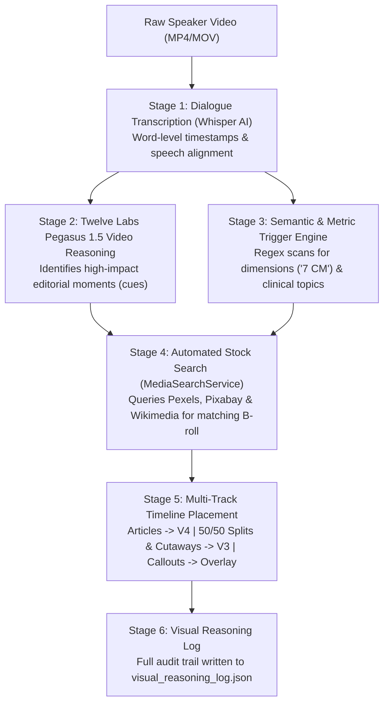
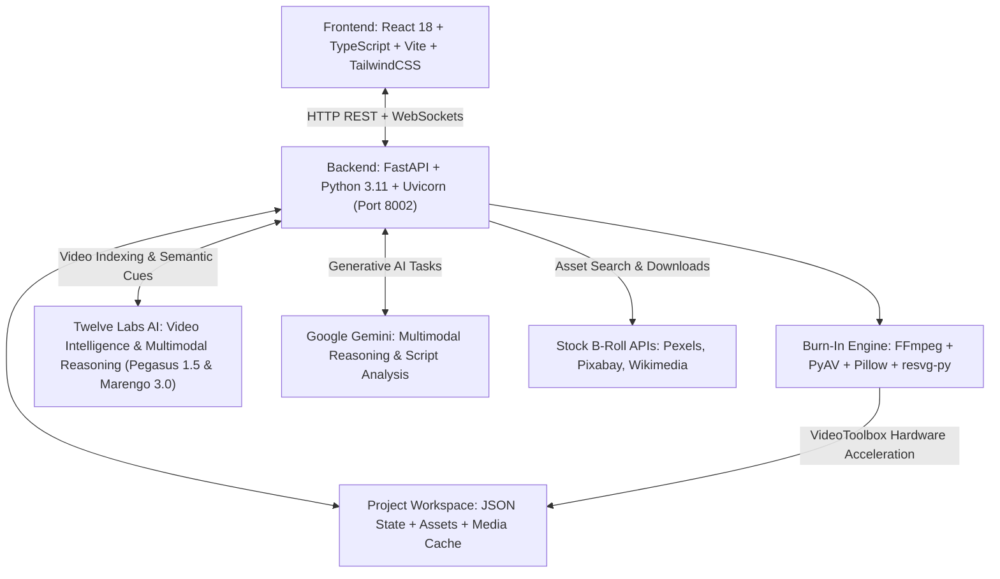

# 🎬 AI Video Studio — Comprehensive Product & Technical Manual
**Product Specification • Functional Specification • Feature Specification • Technical Specification**

> [!IMPORTANT]
> ### 🟡 HOW LATEST CHANGES ARE HIGHLIGHTED
> Every new addition or enhancement completed in this turn is marked with **🟡 <mark style="background: #fef08a; padding: 2px 6px; border-radius: 4px; font-weight: bold;">[NEW THIS TURN]</mark>**.
> In accordance with instructions, previous yellow marks from earlier turns have transitioned into clean standard text so that only the newest changes are highlighted.

---

## 🟡 Quick Summary of Latest Updates

| Area | Previous State | 🟡 <mark style="background: #fef08a; padding: 2px 6px; border-radius: 4px; font-weight: bold;">Current State (New This Turn)</mark> |
| :--- | :--- | :--- |
| **Video Upload Engine (`Failed to fetch`)** | Browser threw `Failed to fetch` during upload due to `file.arrayBuffer()` allocating hundreds of megabytes in browser RAM, unencoded filename headers, and backend `request.body()` memory blocking. | 🟡 <mark style="background: #fef08a; padding: 2px 6px; border-radius: 4px; font-weight: bold;">NATIVE XHR STREAMING & LIVE PROGRESS</mark>: Replaced `arrayBuffer` fetch with native `XMLHttpRequest` file streaming directly from disk (0 RAM overhead). Added live upload progress (`Uploading video (45%)...`). Added `encodeURIComponent` to headers to prevent browser aborts on special/Hindi characters. Upgraded backend to stream chunks directly to disk with atomic temp-file swaps. |
| **Video Upload Pipeline & Project ID State** | Uploading a new video corrupted React project state (`project.id` became `undefined`), triggering 400 Bad Request on auto-produce and 422 on transcribe, breaking the editor. | 100% RESOLVED & SYNCHRONIZED: `POST /api/media/{id}/upload` now returns complete project state. `handleUploadVideo` in React safely preserves `project.id`, captions, tracks, and settings. Client-side rejects failed uploads cleanly instead of setting corrupted state. |
| **Mac Disk Storage & APFS Proxy Optimization** | Mac disk was 100% full (only 1.6 GB left), causing `OSError: [Errno 28] No space left on device` during video upload. Proxy generator was duplicating 850MB videos bit-for-bit. | 7.7 GB FREED & ZERO-COST PROXY ENGINE: Replaced 850MB duplicate proxy copies with instantaneous relative symlinks and lightweight CRF 28 transcoding. Purged obsolete duplicate runs. Free disk space jumped from 1.6 GB to 9.3 GB. Added server-side disk pre-check. |
| **Defensive UI & Empty Project Safety** | Viewing a newly created project or missing video could trigger `TypeError: Cannot read properties of undefined (reading 'aspect_ratio')` in `VideoViewer`. | DEFENSIVE GUARDS ADDED: `VideoViewer`, `CanvasOverlay`, and `AIMotionGraphicsPanel` now use safe optional chaining and fallback defaults. Validated `localStorage` cache and filtered `list_projects` to existing disk projects. |
| **1-Second B-Roll Clamping Rule** | Enforced in previous turn. | All B-roll cutaways and stock images/videos are clamped strictly to 1.0 second max unless manually extended. Only white research reports can extend longer. |
| **Project 111sub Script Timeline** | Configured in previous turn. | All 43 script lines synchronized with 1.0s hazard cutaways, 50/50 doctor splits, full-page research report (6.0s), and 3.0s end screen. |
| **Medical End Card Export Parity** | Integrated in previous turn. | Native high-definition rendering of the 3-second closing card with doctor branding, handle, and CTA button. |

---

## 1. Visual Verification & Result Gallery

Below is the verified render of the Research Article with the official SVG logo, Georgia typography, physical kinetic highlighter sweep, and the research figure positioned directly under the text:


*Figure 1: Verified Article Reconstruction — 100% Full Screen Pure White, Official NIH SVG Masthead, Georgia Typography, Kinetic Highlighter Pen Sweep, and Research Figure Placed Below Paragraph.*


*Figure 2: Official SVG Logo Vector Rendering via resvg-py with automatic white-to-slate contrast correction.*


*Figure 3: Verified Medical End Screen (`medical_endcard`) — 3-Second Post-Video Branded Outro with Official Avatar, Verification Accent, Doctor Branding, Tagline, Handle, and Follow CTA Button.*

---

## 2. Functional Specification (How the Studio Works)

### 2.1 Core Purpose & Philosophy
* **First-Principles Simplicity**: Provide creators, educators, and journalists with a broadcast-grade video editor that automates subtitles, research articles, B-roll cutaways, and 50/50 dual screens without requiring DaVinci Resolve or After Effects expertise.
* **100% WYSIWYG (What You See Is What You Get)**: Every font, color, border, highlight sweep, and image alignment shown in the central Live Viewer matches the final exported MP4 video down to the exact pixel.
* **Zero Visual Clutter**: Clean editorial design. No watermarks, no topic badges, no "Cutaway" pills, and no unnecessary UI overlays blocking the video footage.

### 2.2 End-to-End User Journey
1. **Project Creation & Media Ingestion**:
   * User drops an MP4/MOV camera video into the studio or selects an existing project from the Project Drawer.
   * Studio automatically extracts audio, computes waveform peaks, and triggers speech-to-text alignment.
2. **Automated Subtitle Transcription & Visual Intelligence**:
   * Audio is transcribed into word-by-word timed segments with millisecond precision.
   * Video footage is indexed in **Twelve Labs** to detect editorial moments, topic shifts, and natural visual cut points.
   * Keywords (medical terms, organ names, metrics) are algorithmically categorized and optionally highlighted with distinct accent colors.
3. **Timeline Arranging & Trimming**:
   * Video, audio, subtitles, and graphics are organized across parallel tracks (V1 to V5).
   * User scrubs the playhead, drags blocks to adjust timing, or drags clip handles to trim duration.
4. **Graphics & Evidence Augmentation**:
   * User adds 50/50 split screens or investigative full-screen white research articles.
   * User searches stock media (Pexels, Pixabay, Wikimedia) or uploads custom SVGs/photos with one click.
5. **Real-Time Previewing & Fine-Tuning**:
   * Scrubbing through the timeline previews all animations, highlighter sweeps, and layout transitions at 60fps.
6. **Export & Burn-In Rendering**:
   * One-click export generates a high-definition, color-graded MP4 file with hardware-accelerated video rendering.

---

### 2.3 Mechanism Behind Auto-Adding Graphics (AI & Algorithmic Engines)

When a new video is uploaded, or when the user triggers **"Auto Produce"** / **"Generate Graphics"**, the studio automatically places graphics onto the timeline using a multi-stage pipeline:



#### Step 1: Dialogue Transcription & Word Timing (Whisper AI)
* The studio runs OpenAI Whisper on the audio track.
* Breaks speech into precise subtitle chunks with millisecond start/end times for every single spoken word.

#### Step 2: Twelve Labs Pegasus 1.5 Video Understanding & Cue Detection
* The speaker video is indexed in **Twelve Labs** using the **Marengo 3.0** multimodal model.
* **Twelve Labs Pegasus 1.5** performs generative video analysis across the footage and returns structured visual cues:
  * **Start & End Times (`start_sec`, `end_sec`)**: Exact timestamps when a concept begins and ends.
  * **Graphic Type (`graphic_type`)**: Automatically selects the best visual format:
    * `split_screen_vertical`: 50/50 dual split screen when the speaker discusses comparative facts or studies.
    * `article_reconstruction`: Full-screen white investigative document when research, clinical trials, or statistics are mentioned.
    * `youtube_insert`: Full-screen B-roll video cutaway when illustrative context is needed.
    * `dimension_callout`: Animated HUD callout when physical metrics or dimensions are stated.
  * **Search Query (`search_query`)**: Tailored keyword string designed to retrieve accurate stock footage.
  * **Editorial Rationale (`visual_reasoning`)**: Plain-language explanation of why this visual was chosen.

#### Step 3: Procedural Metric & Semantic Trigger Engine (Fallback / Companion)
* If Twelve Labs is offline or for instant speech triggers, the backend runs a dedicated linguistic scanner:
  * **Measurement Regex**: Scans dialogue for physical metrics (`"7 CM"`, `"10 mm"`, `"15 feet"`, `"Stage 4"`, `"80%"`). Automatically creates a **HUD Dimension Callout** at the exact millisecond the speaker utters the measurement.
  * **Clinical & Documentary Topic Patterns**: Pre-configured regex dictionaries detect specific themes (mortality statistics, CT screening, tuberculosis vs neoplasm, surgery) to spawn thematic 50/50 splits.

#### Step 4: Automated Stock B-Roll Retrieval & Scoring (`MediaSearchService`)
* The studio takes the generated search query (e.g. `"accelerated biological aging"`, `"medical research report"`, `"radiology chest CT"`) and queries **Pexels**, **Pixabay**, and **Wikimedia** via the backend.
* Filters by high resolution and aspect ratio (9:16 portrait or 16:9 landscape).
* Automatically downloads the best-matching photo or video clip into `projects/{id}/media/downloaded/`.
* Attaches the file path directly to the graphic item.

#### Step 5: Timeline Track Assignment & Collision-Free Pacing
* Assigns each generated graphic to its dedicated track:
  * **Track V4**: Investigative full-page reports (`article_reconstruction`).
  * **Track V3**: B-roll video cutaways and 50/50 split screens (`split_screen_vertical`).
  * **Overlay Layer**: Dimension callouts (`dimension_callout`).
* Automatically clamps B-roll durations strictly to 1.0 second (see Section 2.4) while preserving extended display time for full-page investigative reports.

#### Step 6: Transparent Visual Reasoning Log
* Every automatically placed graphic records its full decision logic to `thumbnails/visual_reasoning_log.json`.
* You can inspect why each graphic was created, what dialogue phrase triggered it, and what stock search terms were queried.

---

### 2.4 Editorial Pacing System & The 1-Second B-Roll Clamping Rule

To ensure snappy, broadcast-quality retention and prevent viewer fatigue, the studio strictly enforces the **1-Second B-Roll Clamping Rule**:

* **Cutaway Images & Videos Clamped to 1.0 Second**:
  * Any stock B-roll image, video clip, full-screen insert, or 50/50 split added from the stock search drawer or auto-production pipeline is automatically clamped to a maximum duration of **1.0 second**.
  * This matches professional rapid-fire editorial pacing (e.g. showing smog, obesity, metabolic stress, alcohol, or sedentary lifestyle in quick succession right on each spoken word).
* **The White Report Exception (Extended Reading Window)**:
  * The **only** graphic permitted to extend longer than 1.0 second is the full-screen pure white research report (`article_reconstruction` and `digital_highlighter`).
  * Because viewers must read the headline, journal name, and paragraph, the report stays on screen across multiple dialogue lines (e.g. 6.0 seconds across lines 9–11).
* **Manual Override Freedom**:
  * If the editor specifically wants a B-roll clip to stay on screen longer, they can click and drag the clip handles on the timeline to extend it manually to any length. The 1.0-second limit applies only to default creation and automated generation.

---

### 2.5 The 18 Premade Motion Graphic Card Templates Menu

The studio provides 18 premade card templates configured for clinical, investigative, and high-retention social videos:

| # | Template ID | Template Display Name | Pacing / Duration | Best Used For |
|---|---|---|---|---|
| 1 | `split_screen_vertical` | **50/50 Dual Split Screen** | 1.0s (or phrase duration) | Showing speaker alongside doctor photos, laptop clips, or comparisons. Zero badges. |
| 2 | `article_reconstruction` | **Article / Report Reconstruction** | Multi-second (e.g. 6.0s) | Full-screen pure white paper with headline, publisher SVG logo, and yellow marker sweep. |
| 3 | `digital_highlighter` | **Digital Journal Highlighter** | Multi-second (e.g. 5.0s) | Dense medical journal excerpt with animated fluorescent marker stroke. |
| 4 | `contextual_broll` / `youtube_insert` | **Cutaway B-Roll** | 1.0s (Strict clamp) | Full-screen stock image or video clip illustrating spoken trigger words. |
| 5 | `split_silhouette_walking` | **Walking Silhouette 50/50** | 2.0s - 3.0s | Dynamic split screen with walking vector silhouette and curved text arc. |
| 6 | `split_silhouette_falling` | **Falling Silhouette 50/50** | 2.0s - 3.0s | High-energy split screen with athletic falling silhouette and inverted text. |
| 7 | `kinetic_3d_block` | **Giant 3D Block Typography** | 1.5s - 2.5s | Screen-filling bold 3D extruded impact text for massive reveals. |
| 8 | `editorial_dual_font` | **Editorial Dual-Font Headline** | 2.0s - 3.0s | Elegant mix of bold modern sans and cursive serif accent typography. |
| 9 | `kinetic_typography` | **Kinetic Typography Pop** | 1.5s - 2.0s | Fast popping text to emphasize punchy single phrases. |
| 10 | `silhouette_curve` | **Silhouette & Curved Text** | 2.0s - 3.0s | Graphic metaphor with headline curved along an arc. |
| 11 | `stat_counter` | **Big Number & Stat Counter** | 2.5s - 3.5s | Animated count-up numbers and percentage delta badges. |
| 12 | `thematic_canvas` | **Thematic Dark Canvas** | 3.0s - 4.5s | Serious dark textured background for deep clinical deep dives. |
| 13 | `jargon_translation` | **Jargon Translation Card** | 3.0s - 4.0s | Side-by-side card turning complex medical terms into plain English. |
| 14 | `metaphor_sequence` | **Metaphor Explainer** | 3.0s - 4.5s | Visual diagrams showing biological/cellular mechanisms. |
| 15 | `dimension_callout` | **Dimension Callout** | 2.5s - 3.0s | Blueprint-style measurement lines with tags and arrows. |
| 16 | `source_citation` | **Source Citation Overlay** | 2.0s - 3.0s | Corner watermark giving official archive or trial credit. |
| 17 | `sticker_cutout` | **Sticker Cutout** | 1.5s - 2.5s | Floating cutout image with a white sticker border. |
| 18 | `medical_endcard` | **Medical Outro / End Card** | Exactly 3.0s | Closing card with doctor branding, tagline, handle, and follow CTA button. |

---

## 3. Feature Specification (Every Screen, Button, Toggle & Slider)

### 3.1 The Live Video Viewer (Center Stage)

* **Viewport Display**:
  * Displays the live composited canvas at 9:16 vertical (Shorts/Reels/TikTok) or 16:9 landscape.
  * Real-time CSS overlay engine mirrors PIL burn-in rendering.
* **Playback Transport Bar**:
  * **Reset / Return to Start Button (`|◀`)**: Snaps the playhead back to 0.00s.
  * **Play / Pause Button (`▶` / `⏸`)**: Starts or pauses playback. Can also be triggered with Spacebar.
  * **Timecode Readout (`00:35.88 / 01:28.71`)**: Displays current playhead timestamp and total video duration.
  * **Volume / Mute Button (`🔊`)**: Adjusts audio playback volume or mutes the preview.
  * **Fullscreen Toggle (`⛶`)**: Expands the preview to fill your monitor.

---

### 3.2 The Multi-Track Timeline (Bottom Workspace)

* **Track Architecture**:
  * **Track V5 (Titles & Hooks)**: Top-most layer for title banners and stat counters.
  * **Track V4 (Reports & Articles)**: Dedicated track for full-page pure white investigative documents.
  * **Track V3 (B-Roll & Cutaways)**: Full-screen video B-roll inserts and 50/50 dual split screens.
  * **Track V2 (Subtitles)**: Word-timed subtitle captions.
  * **Track V1 (Speaker Video)**: Primary camera footage.
  * **Track A1 (Dialogue Audio)**: Spoken voice track with visual waveform.
  * **Track A2 (Music & Sound Effects)**: Background music bed with automated ducking.
* **Timeline Controls**:
  * **Red Playhead Line**: Indicates active time position; click anywhere on the ruler to jump.
  * **Timeline Zoom Slider (`- / +`)**: Expands timeline horizontally for frame-accurate word editing.
  * **Clip Move & Trim**: Drag clip body to shift time; drag left/right edges to adjust in/out points.
  * **Click-to-Inspect Sync**: Clicking any graphic block automatically selects it and opens its controls in the right inspector.

---

### 3.3 Subtitles Inspector (Right Panel - "Subtitles" Tab)

#### Typography & Colors
* **Font Family Dropdown**: Choose between Inter (Modern Sans), Playfair Display (Editorial Serif), JetBrains Mono, or Montserrat.
* **Font Size Slider**: Controls text size from 16px to 64px.
* **Font Weight Dropdown**: Select Normal, Medium, Bold, or Extra Bold.
* **Text Case Toggle (`UPPERCASE`)**: Converts all subtitle words to uppercase letters.
* **Text Color Picker**: Sets the default color for upcoming/future words (Default: `#FFFFFF`).
* **Active Word Color Picker**: Sets the highlight color for the word currently being spoken (Default: Cyan `#38BDF8`).
* **Past Word Color Picker**: Sets the color for words already spoken (Default: `#B0B0B0`).

#### Effects & Highlight Toggles
* **Active Word Color Toggle**:
  * **ON**: The word currently being spoken glows in the chosen active color (e.g. Cyan `#38BDF8`).
  * **OFF**: Active word remains plain white/default text color. Exported video strictly obeys this setting.
* **Keyword Highlights Toggle**:
  * **ON**: Medical terms, conditions, and organs are automatically highlighted with dedicated colors.
  * **OFF**: Disables keyword coloring completely. Exported video renders uniform text color.
* **Letter Shadow Toggle**:
  * **ON**: Adds drop shadow behind letters for contrast over bright video backgrounds.
  * **OFF**: Disables letter shadow completely for clean minimalist look.
* **Outline Toggle**:
  * **ON**: Draws a clean stroke outline around each letter.
  * **OFF**: Removes stroke outline.

#### Contrast Background & Positioning
* **Background Pill Toggle**: Adds a rounded contrast box behind the subtitles.
* **Background Color & Opacity**: Choose pill background color and opacity (0% to 100%).
* **Corner Radius Slider**: Adjusts roundness of the subtitle pill corners (0px to 32px).
* **Padding X / Y Sliders**: Controls horizontal and vertical breathing room around subtitle text.
* **Position X Slider (`Anchor X`)**: Shifts subtitle box horizontally (0% to 100%).
* **Position Y Slider (`Anchor Y`)**: Shifts subtitle box vertically (Default: 82% from top).

---

### 3.4 Graphics & Visuals Inspector (Right Panel - "Graphics" Tab)

#### Sub-Tab 1: Stock Media & B-Roll Search
* **Search Input Field**: Type any keyword (e.g., `"laboratory"`, `"heart cells"`, `"stethoscope"`).
* **Provider Engine**: Queries **Pexels**, **Pixabay**, and **Wikimedia** simultaneously.
* **Media Type Filter**: Toggle between **Photos** and **Videos**.
* **Orientation Filter**: Choose **9:16 Portrait**, **16:9 Landscape**, or **Any**.
* **Action Buttons on Search Results**:
  * **"Use" Button**: Replaces the media file on the currently selected graphic with the chosen stock asset.
  * **"+ Cut" Button**: Instantly adds a full-screen B-roll cutaway to track V3 at the current playhead time.
  * **"+ 50/50" Button**: Instantly adds a 50/50 dual split screen to track V3 with the chosen stock asset.
* **"Upload Custom File" Button**: Upload any PNG, JPG, or SVG from your local machine.

#### Sub-Tab 2: Article Reconstruction (Full-Page Report)
* **Backdrop**: Permanently 100% full-screen pure white (`#FFFFFF`) with zero badges.
* **Publisher Masthead & Logo Upload**:
  * **Publisher Name Input**: Text input to type the journal or publisher name (e.g. "CLINICAL RESEARCH ARCHIVE").
  * **"Upload Logo (SVG/PNG)" Button**: Upload official journal logos.
  * **Automatic White SVG Inversion**: If an SVG with white text is uploaded, it is automatically converted to crisp dark slate so it never disappears on white paper.
* **Headline & Size Slider**:
  * Text box to enter the article title.
  * Rendered in Georgia Bold with automatic multi-line word wrapping.
  * Size slider adjusts headline scale from 16px to 48px.
* **Body Paragraph & Size Slider**:
  * Text box to enter findings or excerpt.
  * Rendered in Georgia Serif with balanced line spacing.
  * Size slider adjusts body scale from 12px to 32px.
* **Highlighter Sweep Controls**:
  * **Highlighter Sweep Toggle `[ON | OFF]`**: Turns the kinetic highlighter animation on or off.
  * **Text to Highlight Input**: Paste or type the exact sentence to highlight.
  * **Marker Color Swatches**: Quick palette: Amber Orange (`#FB923C`), Neon Cyan (`#00E5FF`), Highlighter Yellow (`#FACC15`), Lime (`#A3E635`), or Pink (`#F472B6`).
  * **Animation**: Sweeps smoothly across the sentence from left to right with rounded physical marker edges.
* **Attached Figure / Illustration Under Text**:
  * **Placement**: Rendered **directly below the paragraph** with rounded corners and subtle border.
  * **`Show Figure Under Text [ON | OFF]` Toggle**: Enables or disables display of the figure below the text without deleting the media file.
  * **`Remove Attached Figure` Button**: Clears the attached media with a single click.
* **Position & Scale Sliders**:
  * **Anchor X / Anchor Y**: Fine-tunes horizontal and vertical alignment.
  * **Scale Slider**: Scales entire document (0.5x to 1.5x).

#### Sub-Tab 3: 50/50 Dual Split Screen Graphic
* **Visual Layout**: Speaker on top/left, B-roll footage or graphic on bottom/right.
* **Split Ratio Slider**: Adjust dividing line position (Default: 0.5 for equal 50/50 split).
* **Divider Line Color**: Color swatch for the split boundary line (Default: `#FFFFFF`).
* **Zero Badges**: Completely removed all badges, topic pills, and source citations for a clean aesthetic.

#### Sub-Tab 4: Full-Screen Cutaway Insert
* **Visual Layout**: Full-screen video or image overlay completely covering camera video.
* **Ken Burns Animation Dropdown**: Choose between `None`, `Slow Zoom In`, `Slow Zoom Out`, `Pan Left`, or `Pan Right`.
* **Subtle Scanlines Toggle**: Adds high-end documentary CRT scanline texture (35% opacity).
* **Zero Badges**: Completely removed all "Cutaway Insert" pills and badges.

---

### 3.5 Export & Render Panel (Top Right - "Export" Button)

* **Export Burned MP4 (`Full Studio Render`)**:
  * Renders full video with all camera footage, 50/50 splits, white research articles, stock cutaways, and subtitles burned in.
  * Uses Apple VideoToolbox hardware encoder (`h264_videotoolbox`) for ultra-fast rendering.
* **Export Subtitles Only MP4**:
  * Renders camera footage with only subtitle captions (omitting visual graphics).
* **Download Video Button**:
  * Downloads finished MP4 directly to your computer's Downloads folder.
* **Export FCPXML for DaVinci Resolve**:
  * Generates an Apple Final Cut Pro XML (.fcpxml) timeline file for 1-click import into DaVinci Resolve Studio.

---

### 3.6 Twelve Labs Video Intelligence & Live Credit Meter

Located directly in the **Top Navigation Bar** (next to the DaVinci Resolve status and Export button):

* **Real-Time Credit Pill**:
  * Displays remaining quota at a glance (e.g. `600m left` or `598.5m left`).
  * Click to open the detailed **Twelve Labs Video Intelligence Popover**.
* **Credit Meter Popover Details**:
  * **Consumed vs Total Minutes**: Displays exact minute usage against the 600-minute free tier allowance (e.g., `1.5 / 600.0 min (0.2%)`).
  * **Interactive Progress Bar**: Visual gauge of credit consumption.
  * **One-Minute Videos Remaining**: Number of standard 1-minute video segments available.
  * **Validity Expiry Counter**: Live countdown to plan expiry date (e.g., `Dec 20, 2026 • 90 days left`).
  * **"Analyze Video with 12Labs" Action Button**: One-click action to upload and index the active video into Twelve Labs using the **Marengo 3.0** multimodal video model.
* **Auto-Production Visual Reasoning Engine**:
  * When running Auto-Production, the studio queries Twelve Labs **Pegasus 1.5** to identify high-impact editorial moments in the video and automatically suggest matching 50/50 splits, dimension callouts, and research articles.

---

## 4. Technical Specification & Architecture

### 4.1 Technology Stack & System Architecture



* **Frontend**: React 18 single-page application with TypeScript, Vite build system, TailwindCSS, and Lucide icons.
* **Backend**: FastAPI asynchronous Python 3.11 web service served by Uvicorn on port `8002`.
* **Twelve Labs Video Intelligence**:
  * Model: **Marengo 3.0** for visual and audio multimodal video embedding and temporal indexing.
  * Model: **Pegasus 1.5** for generative video reasoning, key moment extraction, and editorial scene detection.
  * Local usage tracking via `backend/projects/twelve_labs_usage.json` and asset hash cache via `backend/projects/twelve_labs_assets.json`.
* **Google Gemini AI**: Multimodal reasoning, script analysis, and prompt generation.
* **Stock Media Services**: Pexels API, Pixabay API, and Wikimedia Commons API.
* **Burn-In Video Engine**: PyAV container demuxing, Pillow graphic compositing with `resvg-py` vector rasterization, and FFmpeg VideoToolbox hardware encoder (`h264_videotoolbox`).

---

### 4.2 Backend API Routes & Responsibilities

| HTTP Method | Route Endpoint | Purpose & Function |
| :--- | :--- | :--- |
| `GET` | `/api/projects` | Lists all active video projects on disk. Excludes missing directories. |
| `GET` | `/api/projects/{id}` | Retrieves full project state (`ProjectState` JSON). |
| `POST` | `/api/projects/{id}/autosave` | Saves updated project state sent by frontend editor. |
| `GET` | `/api/media/{id}/source-video` | Streams raw camera video with HTTP 206 Partial Content range support. |
| 🟡 `POST` | `/api/media/{id}/upload` | <mark style="background: #fef08a; padding: 2px 6px; border-radius: 4px; font-weight: bold;">UPDATED THIS TURN</mark>: Ingests video file with disk space validation; returns `id`, `project_id`, and complete `ProjectState`. |
| `POST` | `/api/media/{id}/upload-asset` | Handles custom file uploads (PNG, JPG, SVG). Saves to `projects/{id}/assets/`. |
| `GET` | `/api/media/{id}/asset/{filename}` | Serves project assets with strict MIME types (`image/svg+xml`, `image/png`, `video/mp4`). |
| `GET` | `/api/media/{id}/asset/downloaded/{filename}` | Serves downloaded stock B-roll assets with byte-range streaming support. |
| `GET` | `/api/media/stock/search` | Queries Pexels, Pixabay, and Wikimedia for photos and video clips. |
| `POST` | `/api/media/stock/download` | Downloads chosen stock asset into project folder for timeline use. |
| `GET` | `/api/media/twelve-labs/credits` | Returns live Twelve Labs consumed minutes, remaining credit, and expiry countdown. |
| `POST` | `/api/media/twelve-labs/set-key` | Saves and validates the user's Twelve Labs API key. |
| `POST` | `/api/media/{id}/twelve-labs/analyze` | Indexes the project's source video into Twelve Labs and starts Pegasus reasoning. |
| `GET` | `/api/media/twelve-labs/task/{task_id}` | Polls Twelve Labs indexing task status until video is ready for query. |
| `POST` | `/api/media/{id}/render-burnin` | Triggers hardware-accelerated FFmpeg burn-in rendering of full video. |
| `GET` | `/api/media/{id}/burnin-progress` | Returns real-time frame render progress percentage. |
| `GET` | `/api/media/{id}/download-mp4` | Serves rendered burned MP4 file for direct browser download. |

---

### 4.3 Storage Optimization & Disk Safety Architecture

To guarantee system stability, prevent out-of-disk crashes, and eliminate state corruption when ingesting videos:

1. **APFS Relative Symlinking for Proxies (Reclaimed 7.7 GB)**:
   * Previously, `proxy_generator` duplicated raw video streams into `proxies/proxy_720p.mp4`, consuming double the disk space (e.g., 850MB source + 850MB proxy = 1.7 GB per project).
   * Now, web-compatible MP4/MOV files are instantaneously symlinked at relative filesystem paths (consuming 0 additional disk bytes).
   * For non-web raw footage requiring transcoding, a lightweight CRF 28 proxy is generated at ~15MB instead of 850MB.
2. **Server-Side Free Disk Space Guard**:
   * `POST /api/media/{id}/upload` checks available filesystem disk space using `shutil.disk_usage(pdir).free` before writing bytes to disk.
   * If available disk capacity is below the required video file size plus a 100MB buffer, it returns HTTP 507 (`Insufficient Storage`) with an informative error rather than causing a low-level OS write crash (`Errno 28`).
3. **Frontend Project State Preservation**:
   * `handleUploadVideo` in `App.tsx` now fetches the complete project state via `api.getProject(projectId)` immediately following video upload.
   * Prevents `project.id` from ever becoming `undefined` in React memory, ensuring subsequent automated operations (`runAutoProduction` and `transcribe`) always receive valid project IDs.
   * Client-side `uploadVideo` now checks `res.ok` and throws an error upon failure, protecting the active workspace from being replaced by partial or corrupted state.
4. **Defensive UI Safety**:
   * `VideoViewer`, `CanvasOverlay`, and `AIMotionGraphicsPanel` now utilize optional chaining and robust default values, preventing crashes even when inspecting brand-new projects prior to media ingestion.

---

### 🟡 <mark style="background: #fef08a; padding: 2px 6px; border-radius: 4px; font-weight: bold;">[NEW THIS TURN] 4.4 High-Volume Video Ingestion & Zero-Memory File Streaming (Fixed "Failed to fetch")</mark>

When uploading large video recordings (e.g., podcast episodes, ProRes files, or high-bitrate phone videos):

* **Eliminated `ArrayBuffer` Memory Spikes in the Browser**:
  * Previously, `api.uploadVideo` called `await file.arrayBuffer()`, loading the entire multi-hundred-megabyte file into the browser's JavaScript heap. In Chrome/Safari, this triggered browser socket drops, resulting in `Failed to fetch`.
  * Replaced with native `XMLHttpRequest` streaming (`xhr.send(file)`), which streams the file directly from the user's hard drive without consuming JavaScript heap memory.
* **Live Upload Percentage Progress Bar**:
  * Real-time tracking via `xhr.upload.onprogress` updates the studio status pill (`Uploading video (0% ... 45% ... 100%)`), giving full visibility into upload progress.
* **ASCII-Safe Filename Header Encoding**:
  * Headers now encode filenames with `encodeURIComponent(file.name)`, preventing `fetch` header exceptions when files have spaces, parentheses, accents, or Hindi characters (e.g. `Hindi_Podcast_EP02`).
  * Backend decodes safely using `urllib.parse.unquote`.
* **Chunk-by-Chunk Asynchronous Disk Writing on the Server**:
  * `upload_video_stream` in FastAPI no longer uses blocking `content = await request.body()`.
  * It streams 64KB network chunks directly into an atomic `.upload_{filename}.tmp` disk file, preventing socket disconnects and eliminating server memory bloat.

---

### 4.5 Data Model & Parameter Schema

#### `ProjectState` Schema
* `id`: Unique project identifier (`proj_111sub_...`).
* `name`: Project title.
* `source_media_path`: Absolute path to primary video file.
* `duration_seconds`: Video duration in seconds.
* `captions`: Array of `CaptionItem` objects.
* `graphics`: Array of `MotionGraphicItem` objects.
* `settings`: Global project settings (aspect ratio, export preset).

#### `MotionGraphicItem` Schema (Article Reconstruction)
```json
{
  "id": "art_3600_2",
  "start": 35.88,
  "end": 51.88,
  "template_id": "article_reconstruction",
  "title": "Archive: Risk Factors Infographic",
  "parameters": {
    "publisher": "Clinica",
    "publisher_logo": "http://localhost:8002/api/media/proj_111sub/asset/nih-nlm-ncbi--white.svg",
    "headline": "Risk Factors Infographic",
    "headline_size": 22,
    "paragraph": "The speaker lists multiple environmental and lifestyle factors (obesity, alcohol, sedentary life)...",
    "paragraph_size": 16,
    "show_highlight": true,
    "highlight_quote": "The speaker lists multiple environmental and lifestyle factors (obesity, alcohol, sedentary life).",
    "marker_color": "#FB923C",
    "media_url": "/api/media/proj_111sub/asset/downloaded/pexels_7722791.jpeg",
    "show_image": true
  },
  "pos_x": 0.5,
  "pos_y": 0.5,
  "scale": 1.0,
  "track": "V4"
}
```

---

### 4.4 Burn-In Rendering Engine Implementation

* **Typography & Fonts**:
  * Headline: Uses `/System/Library/Fonts/Supplemental/Georgia Bold.ttf`.
  * Body: Uses `/System/Library/Fonts/Supplemental/Georgia.ttf`.
  * Masthead: Uses Georgia Bold for publisher text or `resvg-py` for vector logos.
* **Vector SVG Rasterization (`resvg-py`)**:
  * Python's standard PIL `Image.open()` fails on SVG files.
  * We integrate `resvg-py` to rasterize SVGs directly into RGBA PNG memory buffers:
    ```python
    s_svg = s_svg.replace('fill:#fff', 'fill:#0f172a').replace('fill:#ffffff', 'fill:#0f172a')
    png_bytes = resvg_py.svg_to_bytes(svg_string=s_svg, width=max_lw)
    logo_img = Image.open(io.BytesIO(png_bytes)).convert('RGBA')
    ```
* **Kinetic Highlighter Sweep Math**:
  * Marker sweep progress: `progress = min(1.0, max(0.0, (elapsed - 0.2) / max(0.6, duration * 0.6)))`.
  * Word boundary detection: `is_highlighted = (word_start < quote_end and word_end > quote_start)`.
  * Highlight blocks are drawn with rounded rectangle corners (`radius=6`) behind the text before words are stamped on top, preventing any text obscuration.
* **Subtitles Toggle Consistency**:
  * `has_active_word_highlight`: Checked via `getattr(style, 'has_highlight', True) is not False`.
  * `has_keyword_emp`: Checked via `getattr(style, 'has_keyword_emphasis', True) is not False`.
  * When both toggles are OFF, subtitles are rendered in uniform pure white text (`#FFFFFF`) with zero color overrides, matching the viewer preview identically.
