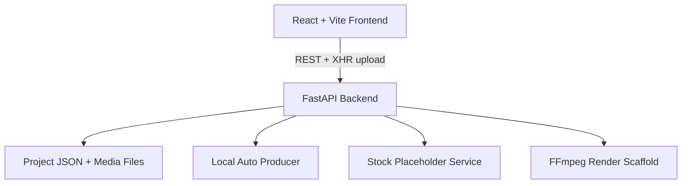

# AI Video Studio Context

This codebase is a clean implementation of the product described in `../STUDIO_FEATURE_MANUAL.md`.

## Architecture

## Backend responsibilities

- `backend/app/main.py`: FastAPI route table and request/response coordination.
- `backend/app/models.py`: shared Pydantic project, caption, graphic, stock, task, and render schemas.
- `backend/app/storage.py`: project directories, atomic JSON state saves, file naming, symlink/copy helpers, and safety-checked project deletion.
- `backend/app/media_utils.py`: chunked upload, range streaming, proxy creation, duration probing.
- `backend/app/auto_producer.py`: local semantic trigger engine and 1-second B-roll clamp.
- `backend/app/stock_media.py`: local SVG stock placeholders and asset attachment.
- `backend/app/twelve_labs.py`: Twelve Labs key/credit/task scaffold.
- `backend/app/renderer.py`: burn-in render job scaffold.

## Frontend responsibilities

- `frontend/src/App.tsx`: app state orchestration, upload progress, project deletion, actions, render polling.
- `frontend/src/api/client.ts`: typed API client and zero-copy XHR file streaming.
- `frontend/src/components/ProjectDrawer.tsx`: project create/open/delete drawer.
- `frontend/src/components/VideoViewer.tsx`: video element, playback transport, live canvas overlay.
- `frontend/src/components/CanvasOverlay.tsx`: captions and motion graphic preview layers.
- `frontend/src/components/Timeline.tsx`: multi-track timeline, playhead, clip selection.
- `frontend/src/components/Inspector.tsx`: subtitle settings, graphic settings, stock search, AI key panel.
- `frontend/src/components/ExportPanel.tsx`: render and download controls.

## Current scaffold behavior

- Uploads are streamed from the browser and written chunk-by-chunk server-side.
- If `ffprobe` is installed, source duration is detected; otherwise duration remains `0` until extended.
- Auto-production generates sample captions when no transcript exists, then creates article, B-roll, dimension, and end-card graphics.
- Stock search creates local SVG placeholders so the app works without external API keys.
- Render endpoint transcodes with FFmpeg VideoToolbox when possible, otherwise copies the source video as the downloadable output.
